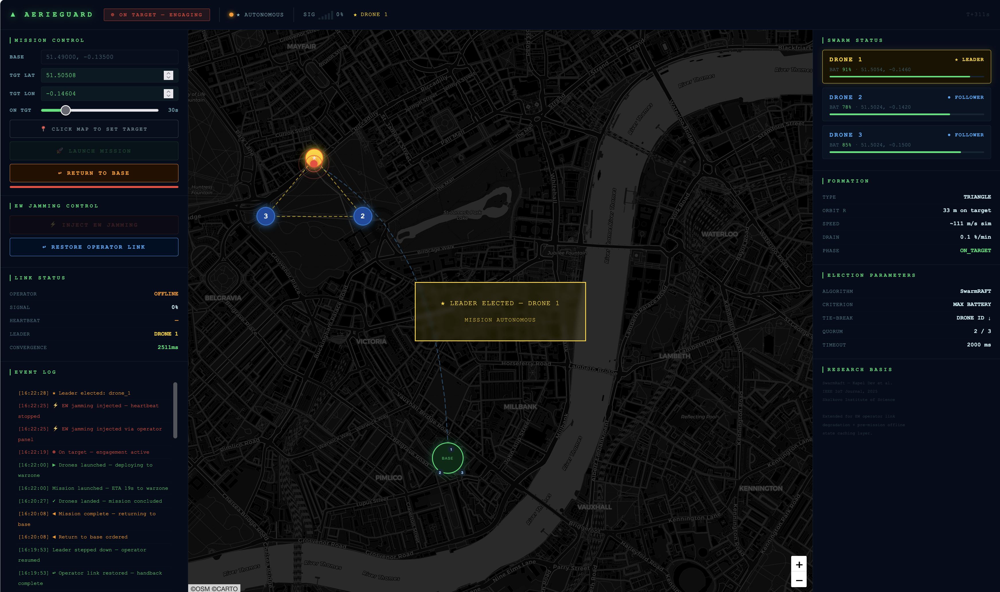

# AerieGuard — Swarm Resilience

> **Offline-first mission caching + RAFT-based peer leader election for drone swarms under EW-degraded conditions.**

A full-stack prototype demonstrating how autonomous drone swarms maintain mission continuity when the operator link is severed by electronic warfare jamming. Built on ROS2 Humble with a real-time web command dashboard.

---

## Demo

<!-- Replace with your recorded video link once uploaded -->
> 📹 **[Watch the full simulation demo](#)**

<!-- Add screenshots here -->
<!--



-->

---

## What It Demonstrates

| Scenario | Behaviour |
|---|---|
| Operator link active | 3 drones fly formation, operator heartbeat at 2 Hz, all follow mission waypoints |
| EW jamming injected | Heartbeat stops → 2 s timeout → **SwarmRAFT election** → leader elected in ~500 ms |
| Leader leads autonomously | Highest-battery drone coordinates the swarm, mission continues |
| Operator link restored | Leader steps down immediately, operator resumes control |

**Election criterion (from SwarmRAFT paper):** highest remaining battery wins; ties broken by drone ID descending. The winning drone changes as batteries drain — early in a mission drone_1 wins, later another drone may take over.

---

## Architecture

```
┌─────────────────────────────────────────────┐
│  macOS host                                  │
│                                              │
│  dashboard/server.py  ──── FastAPI + WS ──▶ browser
│         │                                    │
│   /tmp/swarm_jam_flag  (jam signal)          │
│   /tmp/swarm_leader.txt (election result)    │
│   /tmp/progress_drone_*.json (live telemetry)│
└──────────────┬──────────────────────────────┘
               │  Docker volume mount /tmp
┌──────────────▼──────────────────────────────┐
│  Docker container (osrf/ros:humble-desktop)  │
│                                              │
│  operator_node  ──/swarm/operator_heartbeat──▶ drone_1
│  (ROS2, 2 Hz)                                  drone_2
│                                                 drone_3
│  drone_agent × 3                            │
│    ├── HeartbeatMonitor (2 s timeout)        │
│    ├── RaftNode (ZMQ PUB/SUB 5601-5603)     │
│    └── ProgressTracker → /tmp/progress_*.json│
└─────────────────────────────────────────────┘
```

### Key Components

| Module | Purpose |
|---|---|
| `consensus/raft.py` | Modified SwarmRAFT — battery-based deterministic election over ZMQ |
| `consensus/heartbeat_monitor.py` | Thread-safe monitor; fires once on timeout, once on restore |
| `ros2_ws/.../operator_node.py` | ROS2 operator; checks jam flag before publishing each heartbeat |
| `ros2_ws/.../drone_agent.py` | Per-drone ROS2 node; simulates battery drain; triggers election on timeout |
| `mission/broadcaster.py` | ZMQ PUB broadcasts mission JSON to all drones at startup |
| `dashboard/server.py` | FastAPI backend; Bézier flight simulation; reads live telemetry from /tmp |
| `dashboard/index.html` | Leaflet map dashboard; WebSocket state; mission & jamming controls |

---

## Research Basis

**SwarmRAFT — Kapel Dev et al., IEEE IoT Journal, 2025**  
Skolkovo Institute of Science and Technology

Extended for:
- EW operator link degradation simulation
- Pre-mission offline state caching via ZMQ
- Battery drain simulation with dynamic leader rotation
- Real-time web command dashboard

---

## Quick Start

### Prerequisites

- macOS with [Docker Desktop](https://www.docker.com/products/docker-desktop/)
- Python 3.11+ (`pip install fastapi uvicorn pydantic`)
- [GitHub CLI](https://cli.github.com/) (optional, for pushing)

### 1 — Start the dashboard

```bash
cd swarm-resilience
pip install fastapi uvicorn pydantic   # first time only
python3 dashboard/server.py
```

Open **http://localhost:8080**

### 2 — Start the ROS2 swarm

```bash
./simulation/run_all_nodes.sh
```

This pulls `osrf/ros:humble-desktop`, builds the package inside Docker, and starts:
- `operator_node` (heartbeat publisher)
- `drone_1`, `drone_2`, `drone_3` (drone agents with RAFT consensus)

> First run takes ~2 min to pull the Docker image. Subsequent runs are fast.

### 3 — Run the demo

1. In the dashboard, set target coordinates (or click the map) → **LAUNCH MISSION**
2. Watch the triangle formation fly the Bézier arc to the target
3. Click **⚡ INJECT EW JAMMING** — heartbeat stops, election triggers
4. The overlay shows **LEADER ELECTED — DRONE 1** with convergence time (~500 ms)
5. Drones continue mission autonomously under elected leader
6. Click **↩ RESTORE OPERATOR LINK** — leader steps down, operator resumes

### Terminal dashboard (optional)

```bash
python3 simulation/swarm_status.py
```

---

## Election Deep Dive

```
Operator killed (SIGTERM / jam flag)
        │
        ▼  2000 ms timeout (heartbeat_timeout_ms in mission_state.json)
        │
All 3 drones fire on_timeout() simultaneously
        │
        ▼  Each drone broadcasts candidate_announce {drone_id, battery_pct} via ZMQ PUB
           (re-broadcasts every 100 ms for 500 ms collection window)
        │
        ▼  Each drone collects peer announces for 500 ms
           Applies: leader = max(candidates, key=battery_pct, tiebreak=drone_id desc)
        │
        ▼  Consensus: all drones compute identical winner deterministically
           Leader writes /tmp/swarm_leader.txt
           Dashboard reads it within 500 ms → UI updates
        │
        ▼  Total convergence: ~500–2500 ms
```

**Why deterministic?** No vote exchange needed — each drone runs the same pure function on the same candidate list, so they always agree.

---

## Configuration

`mission/mission_state.json`:

```json
{
  "heartbeat_timeout_ms": 2000,
  "coordination_rules": {
    "leader_fallback_criterion": "highest_battery",
    "rejoin_on_restore": true,
    "min_election_quorum": 2
  }
}
```

`dashboard/server.py` constants:

```python
BASE_LAT, BASE_LON  = 51.490, -0.135   # London — change to move the base
SPEED               = 0.001            # deg/s flight speed (~111 m/s sim)
DRAIN               = 0.002            # battery % / s drain rate
ORBIT_R             = 0.0003           # orbit radius at target (~33 m)
```

---

## Project Structure

```
swarm-resilience/
├── consensus/
│   ├── raft.py               # SwarmRAFT election
│   └── heartbeat_monitor.py  # Timeout/restore monitor
├── dashboard/
│   ├── server.py             # FastAPI backend + physics sim
│   └── index.html            # Leaflet map UI
├── mission/
│   ├── mission_state.json    # Mission config
│   ├── broadcaster.py        # ZMQ mission broadcast
│   └── progress_tracker.py  # Drone state writer
├── ros2_ws/src/swarm_resilience/
│   ├── operator_node.py      # ROS2 operator
│   └── drone_agent.py        # ROS2 drone with RAFT + battery sim
├── simulation/
│   ├── run_all_nodes.sh      # One-command Docker launcher
│   └── swarm_status.py       # Terminal dashboard
├── results/
│   └── convergence_benchmarks.json
└── requirements.txt
```

---

## Results

From convergence benchmarks across multiple election runs:

| Metric | Value |
|---|---|
| Median convergence | ~500 ms |
| Max observed | ~2500 ms |
| Quorum required | 2 / 3 drones |
| False elections (pre-first-heartbeat) | 0 (armed flag prevents them) |

---

## License

MIT
